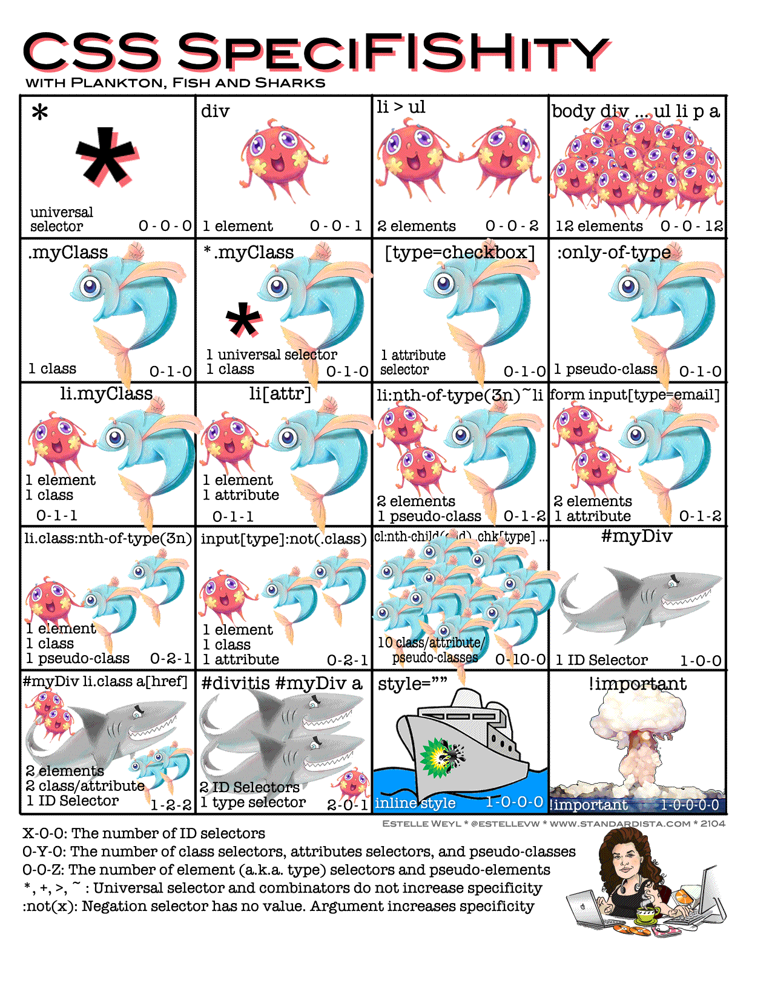

# Web 최종 정리

## HTML(Hyper Text Markup Language)

- HTML문서의 기본구조(!+tab)

  - html : 문서의 최상위(root) 요소

  - head : 문서 메타데이터 요소

    - 문서 제목, 인코딩, 스타일, 외부 파일 로딩 등
    - 일반적으로 브라우저에 나타나지 않는 내용

    head 예시

    ​	\- \<title> : 브라우저 상단 타이틀

    ​	\- \<meta> : 문서 레벨 메타데이터 요소

    ​	\- \<link> : 외부 리소스 연결 요소(CSS파일, favicon 등)

    ​	\- \<script> : 스크립트 요소(JavaScript 파일/코드)

    ​	\- \<style> : CSS 직접 작성

  - body : 문서 본문 요소

    - 실제 화면 구성과 관련된 내용

  

  `요소(element)` == 태그(tag)

  - 내용이 없는 태그 : br, hr, img, input, link, meta
  - 중첩(nested)을 통해 문서를 구조화

  `속성(attribute)`

  - 태그의 부가적인 정보

  - 시작 태그에 작성하며 보통 이름과 값이 하나의 쌍으로 존재

  - 태그와 상관없이 사용 가능한 속성(HTML Global Attribute)들도 있음

    `HTML Global Attribute`

    + id : 문서 전체에서 유일한 고유 식별자 지정
    + class : 공백으로 구분된 해당 요소의 클래스 목록
    + data-* : 페이지에 개인 사용자 정의 데이터를 저장하기 위해 사용
    + style : inline 스타일
    + title : 요소에 대한 추가 정보 지정
    + tabindex : 요소의 탭 순서

  

- 시맨틱 태그

  - HTML5에서 의미론적 요소를 담은 태그의 등장
  - 기존 영역을 의미하는 `div`태그를 대체하여 사용

  대표적인 태그 목록

  ​		\- header : 문서 전체나 섹션의 헤더(머리말 부분)

  ​		\- nav : 네비게이션 (주로 화면 상단에 메뉴목록)

  ​		\- asdie : 사이드에 위치한 공간

  ​		\- section : 문서의 일반적인 구분, 컨텐츠의 그룹을 표현

  ​		\- article : 문서, 페이지, 사이트 안에서 독립적으로 구분되는 영역

  ​		\- footer : 문서 전체나 섹션의 마지막 부분

  -  Non semantic 요소는 div, span 등이 있으며 h1, table 태그들도 시맨틱 태그로 볼 수 있다

  - 검색엔진최적화 등에 의미 있는 정보의 그룹을 태그로 표현

  - 요소의 의미가 명확해지기 때문에 가독성을 높이고 유지보수를 용이하게 함

    

- DOM(Document Object Model) 구조

  - 텍스트 파일인 HTML 문서를 브라우저에서 렌더링하기 위한 구조
  - HTML 문서 내의 각 요소에 접근/수정에 필요한 프로퍼티와 메소드를 제공 

- 주요 태그와 속성

  - ~~table, form, input~~ 안나옴

  - \<a>\</a> : `href`속성을 활용하여 다른 URL로 연결하는 하이퍼링크 생성

  - \<b>\</b>, \<storng>\</strong> : 굵은 글씨

  - \<i>\</i>, \<em>\</em> : 기울임 글씨

  - \  : 텍스트 내 줄 바꿈

  - \ : `src`속성을 활용하여 이미지 표현, `alt`속성으로 이미지 없을 경우 텍스트 표기

  - \\ : 의미없는 인라인 컨테이너

  - \
\
 : 하나의 문단(`p`ragraph)

  - \
 : 주제의 분리를 의미, 수평선으로 표현됨(A `H`orizontal `R`ule)

  - \<ol>\</ol> : 순서가 있는 리스트(`O`rdered)

  - \<ul>\</ul> : 순서가 없는 리스트(`U`nordered)

  - \<pre>\</pre> : HTML에 작성한 내용을 그댈 표현, 고정폭 글꼴이 사용되고 공백문자를 유지

  - \<blockquote>\</blockquote> : 텍스트가 긴 인용문, 주로 들여쓰기를 한 것으로 표현

  - \
\
 : 의미 없는 블록 컨테이너

  - \<table>\</table> : \<thead>\</thead>, \<tbody>\</tbody> , \<tfoot>\</tfoot>으로 구성

    - thead : \<tr>\<th>\</th>\</tr> 로 구성
    - tbody, tfoot : \<tr>\<td>\</td>\</tr> 로 구성

  - \<form> : 정보(데이터)를 서버에 제출하기 위한 영역

    - action : form을 처리할 서버의 URL
    - method : 제출할 때 사용할 HTTP 메소드

  - \<input> : 다양한 타입을 가지는 입력 데이터 유형과 위젯이 제공됨

    - name : form control에 적용되는 이름
    - value : form control에 적용되는 값
    - 그 외 : required, readonly, autofocus, autocomplete, disabled 등

    `input 유형(type)`

    ​		\- text : 일반 텍스트

    ​		\- password : 입력 시 값이 마스킹처리되어 표현

    ​		\- email : 이메일 형식만 받음

    ​		\- number : min, max, step 속성을 활용하여 숫자 범위 설정 가능

    ​		\- file : accept 속성을 활용하여 파일 타입 지정 가능

    ​		\- cheackbox : 다중 선택

    ​		\- radio : 단일 선택

    ​		\- color : color picker

    ​		\- date : date picker

    ​		\- hidden : 사용자에게 보이지 않는 input

  - \<label> : 라벨을 클릭해도 input 자체에 초점을 맞춰주거나 활성시켜줌

    - 사용자의 터치 영역이 늘어나 편리하게 사용 가능
    - for속성 값과 input의 id값을 연결하여 상호 연관시켜 사용

## CSS (Cascading Style Sheets)

> 선택하고 스타일을 지정하기 위한 언어
>
> 선택자, 선언, 속성, 값 으로 구성

- 개발자 도구
  - styles : 해당 요소에 선언된 모든 CSS를 보여줌
  - computed : 해당 요소에 최종 계산된 CSS를 보여줌

- 선택자 및 우선순위

  기본 선택자

  - 전체 선택자 : `*`
  - 요소 선택자 : HTML 태그를 직접 선택
  - 클래스 선택자 : 클래스가 적용된 항목 선택 `.classname`
  - 아이디 선택자 : 아이디가 적용된 항목을 선택 `#idname` (id는 단일사용이 필수)
  - 속성 선택자 : `[attribute]`

  의사 클래스/요소(Pseudo Class)

  - 링크, 동적 의사 클래스
  - 구조적 의사 클래스, 기타 의사 클래스, 의사 엘리먼트, 속성 선택자

  ##### `CSS 적용 우선순위(cascading order)`

  1. 중요도 : !important
  2. 우선순위 : inline -> id -> class, 속성, pseudo-class -> 요소, pseudo-element
  3. CSS 파일 로딩 순서

  

- CSS 상속
  - 상속 되지 않는 것
    - box model 관련 요소 : width, height, margin, padding, border, box-sizing, display
    - position 관련 요소 : position, top/right/bottom/left, z-index 등

- 단위(크기, 속성)
  - px(픽셀) : 고정적인 단위
  - % : 백분율, 가변적인 레이아웃에 주로 사용
  - em : 부모요소에 대한 상속 영향, 배수 단위이며 지정된 요소의 상대적인 사이즈
  - rem : 최상위 요소(html)의 사이즈를 기준으로 배수 단위
    - html의 기본 사이즈는 16px이다 -> 0.5rem = 8px
  - viewport : 디바이스 화면을 기준으로 상대적인 사이즈 결정
    - vw, vh, vmin, vmax

- 결합자
  - 자손 결합자 : 부모 요소의 하위 요소들 중 조건을 만족하는 모든 요소에 적용 `공백`
  - 자식 결합자 : 직계자식일 경우에만 적용 `>`
  - 형제 결합자 : 선택자A의 형제 요소 중 뒤에 위치하는 선택자B 요소 `모두 선택` `~`
  - 인접 형제 결합자 : 선택자A의 형제 요소 중 `바로` 뒤에 위치하는 선택자B 요소 선택 `+`

- 박스 모델

  > CSS 원칙 : 모든 요소는 박스 모델이고, 위에서 아래로, 왼쪽에서 오른쪽으로 쌓인다.

  - Margin : 테두리 바깥 외부 여백, 배경색 지정 불가
  - Border : 테두리 영역
  - Padding : 테두리 안쪽의 내부 여백, 배경색과 이미지는 padding까지 적용
  - Content : 요소의 실제 내용
  - 요소의 속성 적용 순서
    - 1개 : 상하좌우 모두 적용
    - 2개 : 상하, 좌우로 적용
    - 3개 : 상, 좌우, 하로 적용
    - 4개 : 상, 하, 좌, 우
  - box-sizing
    - 기본적으로 순수 content-box로만 box-sizing 함
    - 일반적으로 border까지의 너비를 생각할 때는 box-sizing을 border-box로 설정

- display

  - block 

    - 줄 바꿈이 일어남
    - 화면 크기 전체의 가로 폭을 차지
    - 블록 요소 안에 인라인 요소 들어갈 수 있음
    - 대표 요소 : div, ul, ol, li, p, hr, form

    수평정렬 예시 : margin-right: auto; margin-left : auto;

  - inline

    - 줄 바꿈 X, 행의 일부 요소
    - content 너비만큼 가로 폭 차지
    - `박스 크기`를 정의하는 속성 사용 불가 (width, height, margin 같은거)
    - `상하 여백`은 line-height로 지정 가능
    - 대표 요소 : span, a, img, input, label, b, em, i, strong

    수평정렬 예시 : text-align : center;

  - inline-block
    - inline처럼 한 줄에 표시 가능하고 block처럼 width, height, margin 속성 사용 가능
  - none
    - 해당 요소를 화면에 표시하지 않고, 공간조차 부여하지 않음
    - visibility : hidden은 해당 요소가 공간은 차지하나 화면에는 표시 안됌

- Position

  - static : 모든 태그의 기본 값(기준 위치)
    - 배치 순서에 따름(좌측 상단)
    - 부모 요소 내에 배치될 때는 부모 요소의 위치를 기준으로 배치

  좌표 프로퍼티(top, bottom, left, right) 사용 가능한 포지션

  - relative : 상대 위치
    - 자신의 static 위치를 기준으로 이동
    - 레이아웃에서 요소가 차지하는 공간은 static일 때와 동일 -> normal flow 유지
  - absolute (out of flow) : 절대 위치
    - 레이아웃에 공간을 차지하지 않음 -> normal flow에서 벗어남
    - static이 아닌 가장 가까이 있는 부모/조상 요소를 기준으로 이동 (없는 경우 body기준)
  - fixed (out of flow) : 고정 위치
    - 레이아웃에 공간 차지 X
    - viewport 기준으로 이동 -> 스크롤 시에도 화면의 항상 같은 곳에 위치
  - sticky

- ~~Float~~

- Flex

  - 축

    - main axis
    - cross axis
    - flex-direction : row

  - 구성 요소 

    - Flex Container (부모 요소)
      - display : flex 또는 inline-flex
    - Flex Item (자식 요소)

  - 배치 설정

    - flex-direction

      - row, row-reverse, column, column-reverse

    - flex-wrap : 요소들이 강제로 한 줄에 배치되게 할 것인지 여부 설정

      - warp, nowrap(default)

    - flex-flow : flex-direction과 flex-wrap의 shorthand

      ex ) flexflow : row wrap;

  - 공간 나누기

    - justify-content (main axis)
    - align-content (cross axis) : `2줄 이상`일때만 효과가 있다
    - 속성
      - flex-start : axis 시작점으로
      - flex-end : axis 끝 쪽으로
      - center : axis 중앙으로
      - space-between : 아이템 사이의 간격을 균일하게 분배
      - space-around : 아이템이 가질 수 있는 영역을 반으로 나눠서 양쪽에
      - space-evenly : 전체 영역에서 아이템 간 간격을 균일하게 분배

  - 정렬

    - align-items : 모든 아이템을 cross axis 기준으로
    - align-self : 개별아이템을 cross axis 기준으로
    - 속성 (Cross axis를 중심으로)
      - stretch : 컨테이너를 가득 채움
      - flex-start : 위
      - flex-end : 아래
      - center : 가운데
      - baseline : 텍스트 baseline에 기준선을 맞춤

  - align-content VS align-items

    - align-content는 두 줄 이상일때만 사용하며 flew-wrap : wrap 상태일때만 사용한다
    - align-items는 한 줄의 아이템들에게 적용된다
    - align-content는 여러 cross axis들을 정렬한다는 느낌이고
    - align-items는 아이템들을 하나의 cross axis에 맞추어 정렬하는것이다

  - 기타 속성

    - flex-basis (default=auto) : 항목의 크기를 결정

    - flex-grow : 남은 영역을 아이템에게 분배, flex-basis 값 이상으로 늘어날 수 있게 함

    - flex-shrink : 주축의 공간이 부족할 때 각 항목의 사이즈를 줄이도록 함

      > grow와 shrink는 비율 값을 기입함

    - flex : 위 세가지를 한번에 지정하는 shorthand 또는 특정 속성 사용 가능

      ex ) flex : flex-grow flex-shrink flex-basis

      - 속성
        - initial : 0 1 auto
        - auto : 1 1 auto
        - none : 0 0 auto
        - 양수 : grow값만 받고 나머지 shrink랑 basis는 1과 0으로 사용하는 것

    - order : 배치순서

## 반응형 웹

- Grid System : `flexbox`로 제작됨

  - 기본요소

    - column : 실제 컨텐츠를 포함하는 부분

      col은 총 `12개의 비율공간`으로 구분한다

    - gutter : 칼럼과 칼럼 사이의 공간

    - container : column들을 담고 있는 공간

      .container : 반응형 고정 컨테이너 (일정크기 px 사용)

      .container-fluid : 반응형 비율 컨테이너 (width100% 등 비율로 함)

      .container-breakpoint : sm, md 등 브레이크포인트로 공간을 정함

  - 사용법

    - 부모 div요소에 container 부여 (display : grid 또는 class="container")
    - 자식 div요소에 item 부여 (class="item")
    - 또는 자식 div요소에 row 부여

- Breakpoint

  - xs : < 576px
  - sm : >= 576px 
  - md : >= 768px
  - lg : >= 992px
  - xl : >= 1200px
  - xxl : >= 1400px